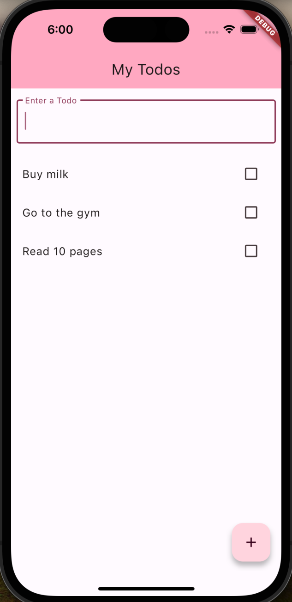

# Flutter Todo List

A simple Todo List built with Flutter.

## Features

- **User-friendly Interface**: A clean interface for a smooth user experience.
- **Add Tasks**: Easily add new tasks to your list.
- **Check off Tasks**: Mark tasks as completed with a slide to the right or with a tap on the checkbox to track your progress.
- **Delete Tasks**: Remove completed tasks or ones that are no longer needed with a swipe to the left. Then select delete
- **Change Tasks**: Change added tasks with a swipe to the left. Then select edit

## Preview

## Installation

1. Clone the repository: `git clone https://github.com/your-username/flutter-todo-list.git`
2. Navigate to the project directory: `cd flutter-todo-list`
3. Install dependencies: `flutter pub get`
4. Run the app: `flutter run`

## Technologies

- Flutter
- Dart

## Contributing

If you have suggestions for improvements or find any bugs, feel free to contribute. Just open an issue or create a pull request.

